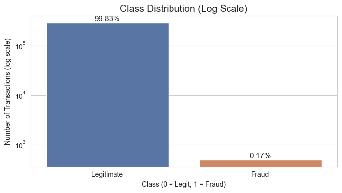
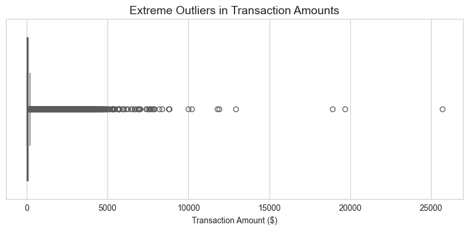

# Adaptive Fraud Detection Pipeline: Active Learning & Concept Drift

This repository implements a production-minded machine learning architecture for credit card fraud detection. 

Moving beyond standard static classification, this system is designed to handle the realities of deployed fraud ML models: extreme class imbalance, severe data outliers, shifting adversarial behavior (concept drift), and the critical need for Human-in-the-Loop (HITL) review pipelines.

## Executive Summary & Key Findings
* **The Accuracy Trap:** In a dataset with 0.17% fraud, a broken model predicting "Not Fraud" every time scores 99.8% accuracy. We optimized strictly for PR-AUC and minimized False Negatives (Financial Loss) and False Positives (Analyst Fatigue).
* **Active Learning Success:** Our Random Forest baseline missed 16 fraudulent transactions. However, by implementing an Uncertainty Router (HITL), the system flagged 11 low-confidence predictions for human review. **All 11 were actual fraud**, rescuing the company from financial loss with a 100% precision rate in the review queue.
* **Defense-in-Depth Necessity:** During a simulated adversarial attack (Concept Drift), the HITL queue *shrank* because the model became confidently wrong. However, our macro-level Statistical Drift Detection (KS-Test) immediately triggered a system alert across 29 features.
* **Conclusion: Robust AI requires both micro-level uncertainty routing and global distribution monitoring.**

---

## 1. The Data Reality: Imbalance & Outliers

Before modeling, an extensive Exploratory Data Analysis (EDA) dictated our preprocessing architecture.

### Extreme Class Imbalance
Fraud represents only ~0.17% of the dataset. 

<p align="center">
  
</p>

**Engineering Choice:** We applied strict class-weighting penalties (`class_weight='balanced'` and `scale_pos_weight`) across all models to force the algorithms to penalize minority class errors heavily. 

### Extreme Outliers & Time Cyclicity
While the V1-V28 features are PCA-transformed, `Amount` and `Time` are raw. The median transaction is $22, but the maximum is over $25,691. 

<p align="center">
  
</p>

**Engineering Choice:** 

1. **Robust Scaling:** Standard scaling relies on the mean, which is dragged up by massive outliers. We implemented `RobustScaler` (relying on median/IQR) specifically for the `Amount` feature.
2. **Chronological Splitting:** Fraud is an adversarial time-series problem. Randomly shuffling the data (`train_test_split`) leaks future fraud patterns into the training set. We enforced strict chronological splitting (Train -> Val -> Test) to simulate real-world production.

---

## 2. Baseline Models & Active Learning (HITL)

We evaluated three architectures to establish our baseline:
1. **Logistic Regression:** A fast, interpretable linear baseline.
2. **Random Forest:** An ensemble method robust to non-linear relationships and overfitting.
3. **XGBoost:** The industry standard for tabular data performance.

### The Problem: Blind Model Acceptance
Without active learning, models are forced to make hard predictions even when they are statistically guessing. 

**Random Forest Baseline Output (Standard Pipeline):**
```text
Accuracy: 0.9996  <-- THE ACCURACY TRAP (Misleading)
PR-AUC:   0.8637  <-- TRUE PERFORMANCE
F1-Score: 0.8333

Confusion Matrix:
  True Negatives:  42665
  False Positives: 0
  False Negatives: 16  <-- 16 Fraudsters escaped
  True Positives:  40
```

### The Solution: Human-in-the-Loop (HITL) Routing

We built an Active Learning router. If a model's prediction probability falls near the decision boundary (`0.40 - 0.60`), it is mathematically uncertain. Instead of guessing, the system traps these transactions and routes them to a human analyst.

**Random Forest Output WITH Active Learning Router:**

```text
Confusion Matrix:
  True Negatives:  42665
  False Positives: 0
  False Negatives: 16
  True Positives:  40

Active Learning (Human-in-the-Loop Queue):
  Transactions Flagged for Review (Uncertainty 0.4-0.6): 11
  Actual Fraud Rescued by HITL: 11
```

*Note: The HITL router successfully trapped 11 of the 16 missed frauds without wasting analyst time on a single false positive.*

---

## 3. Concept Drift & Defense-in-Depth

Deployed models eventually fail because adversaries adapt. To test our pipeline’s resilience, we simulated a massive concept drift scenario (`notebooks/02_concept_drift_simulation.ipynb`), altering the statistical fingerprints (V4, V11, V14) of fraud transactions in the future test set to mimic a novel scamming tactic.

### The Adversarial Attack Result
The Random Forest model was completely blind to the new attack vector. Financial losses skyrocketed instantly.

```text
Normal Future - False Negatives (Missed Fraud): 19
Normal Future - True Positives (Caught Fraud):  33

Adversarial attack simulated. Scammers have shifted their behavior on V4, V11, and V14.

--- MODEL PERFORMANCE POST-DRIFT ---
Missed Fraud Before Attack: 19
Missed Fraud AFTER Attack:  38
Caught Fraud Before Attack: 33
Caught Fraud AFTER Attack:  14

Conclusion:
The model is completely blind to the new attack vector. Financial losses are skyrocketing.
```

### The System Response: Defense-in-Depth Activation

When the primary model failed, how did our safety nets perform?

**1. The Active Learning (HITL) Router Output:**

```text
=======================================================
ACTIVE LEARNING ROUTER: BEFORE VS AFTER ATTACK
=======================================================
BEFORE DRIFT (Normal Baseline):
  Transactions Flagged for Review: 9
  Actual Fraud Rescued by HITL:    8

AFTER DRIFT (Under Attack):
  Transactions Flagged for Review: 4
  Actual Fraud Rescued by HITL:    3
```

**2. The Statistical Drift Detection (KS-Test) Output:**

```text
Running Statistical Drift Detection (KS-Test)...

SYSTEM ALERT: 29 features have significantly drifted from the baseline distribution.

Drifted Features Details:
 [!] V1: p-value = 4.1280e-06
 [!] V2: p-value = 4.3206e-52
 [!] V3: p-value = 1.0900e-09
 [!] V4: p-value = 4.6765e-12
 ...
 [!] Scaled_Amount: p-value = 1.0394e-126
```

### Conclusion:

This simulation reveals a critical production vulnerability and demonstrates why **defense-in-depth** is required for real-world ML systems.

Notice that the HITL queue actually **SHRANK** during the attack (from 8 rescued to 3). The adversarial shift pushed fraudulent transactions far away from the decision boundary. Instead of being uncertain (0.4–0.6), the model became confidently wrong (<0.4), so the transactions never reached the human review queue.

This shows that uncertainty-based HITL routing alone cannot stop large, novel attack patterns.

However, while the micro-level HITL system failed, the macro-level Statistical Drift Detection (KS-Test) triggered a massive system alert across 29 features. Because the dataset uses PCA-transformed variables, shifting a few core fraud features propagated statistical changes across the entire feature space.

**A robust ML pipeline requires BOTH systems: local uncertainty routing AND global distribution monitoring.**

---

## 4. Project Structure

```text
adaptive-fraud-pipeline/
│
├── data/                                 # Raw and processed datasets
├── notebooks/
│   ├── 01_imbalance_baselines.ipynb      # EDA, Scaling justification, and baseline model comparisons
│   └── 02_concept_drift_simulation.ipynb # Simulating adversarial drift and HITL recovery
│
├── src/
│   ├── __init__.py
│   ├── preprocessing.py                  # Feature scaling, time-based chronological splits
│   ├── models.py                         # Model definitions (XGBoost, Random Forest, LR)
│   ├── active_learning.py                # Uncertainty quantification and HITL routing
│   ├── drift_detection.py                # Feature distribution monitoring (KS tests)
│   └── evaluation.py                     # PR-AUC, Confusion Matrices, Threshold tuning
│
├── train_model.py                        # Main training pipeline execution script
├── requirements.txt                      # Project dependencies
└── README.md
```

## 5. Quick Start & Execution

To run this pipeline locally and recreate the results:

1. **Clone the repository and install dependencies:**
```bash
git clone https://github.com/yourusername/adaptive-fraud-pipeline.git
cd adaptive-fraud-pipeline
pip install -r requirements.txt
```

2. **Add the Data:**  
Download the [Credit Card Fraud Detection dataset from Kaggle](https://www.kaggle.com/datasets/mlg-ulb/creditcardfraud) and place `creditcard.csv` inside the `data/` directory.

3. **Explore the Data & Justify Preprocessing:**  
Run `notebooks/01_imbalance_baselines.ipynb` to view the extreme class imbalance and justification for Robust Scaling.

4. **Train the Baseline Pipeline:**  
Execute the main training script to see the Accuracy Trap and the effectiveness of the Active Learning queue:

```bash
python train_model.py
```

5. **Simulate the Adversarial Attack:**  
Run `notebooks/02_concept_drift_simulation.ipynb` to witness the baseline model fail, the HITL queue shrink, and the Drift Detection system successfully trigger the global alarm.
